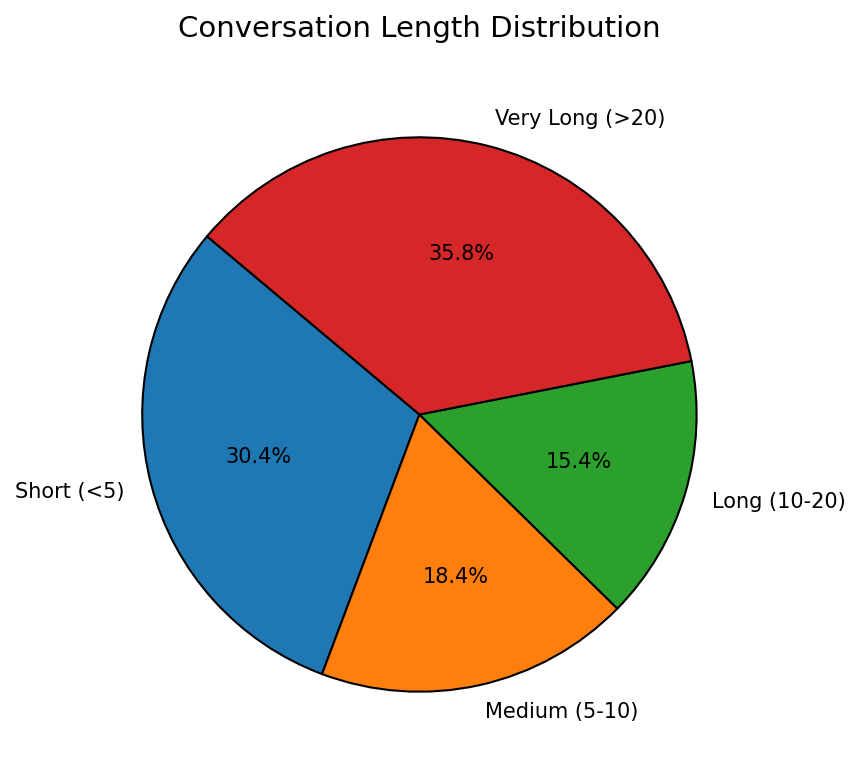
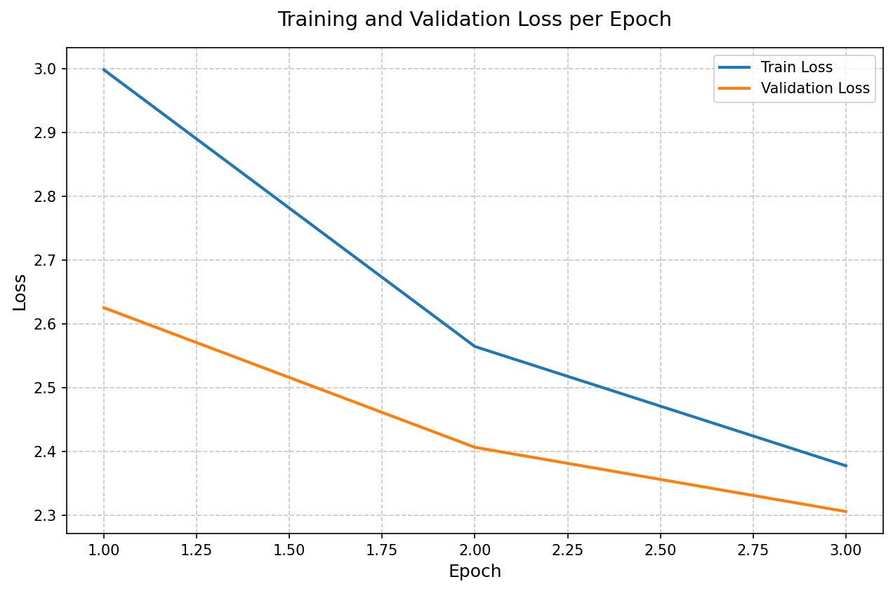
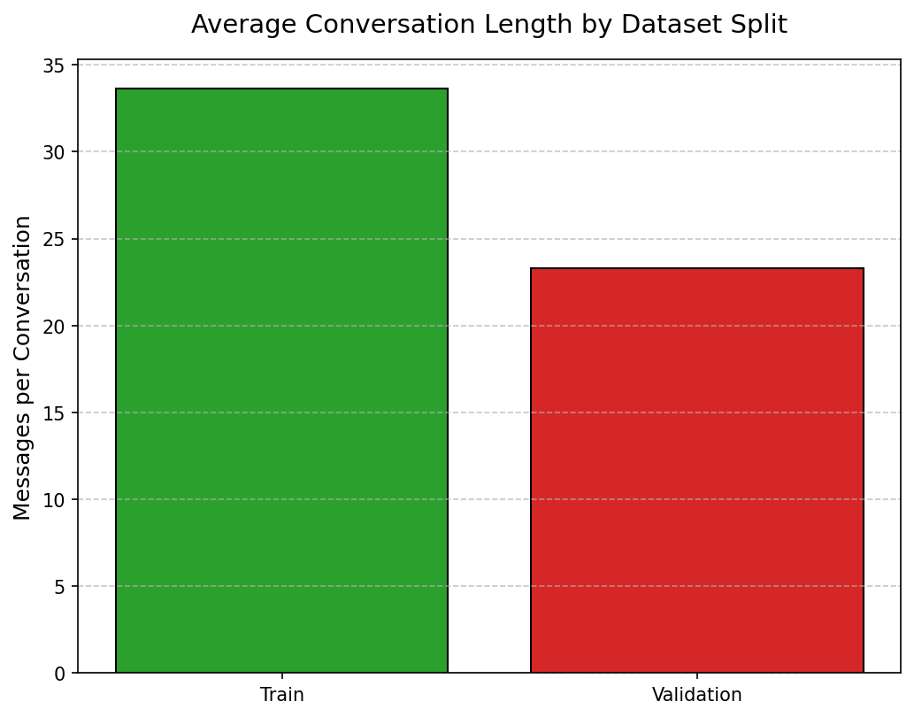
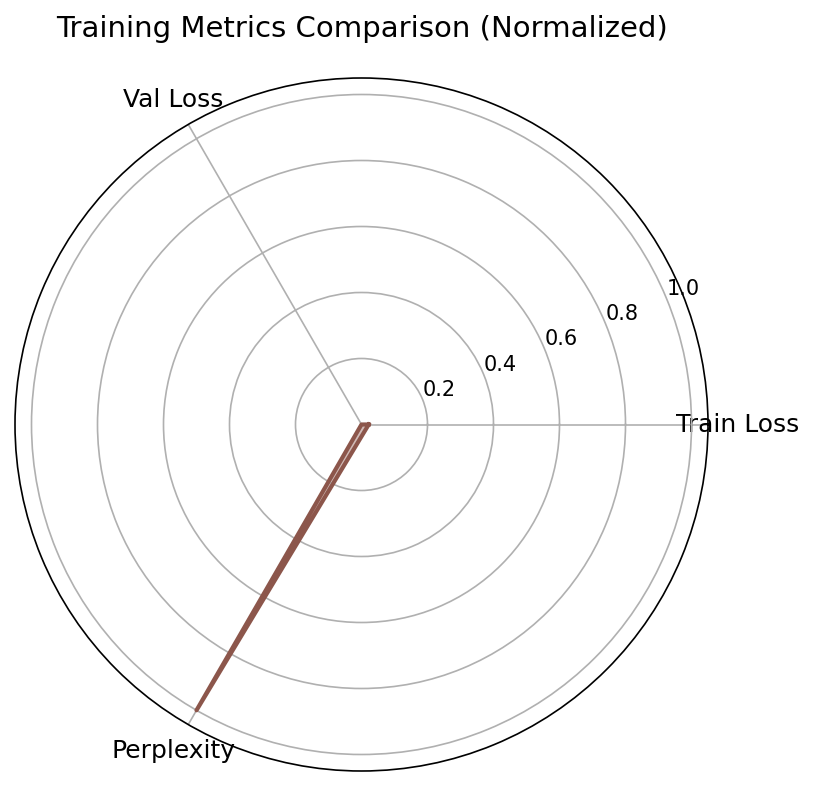
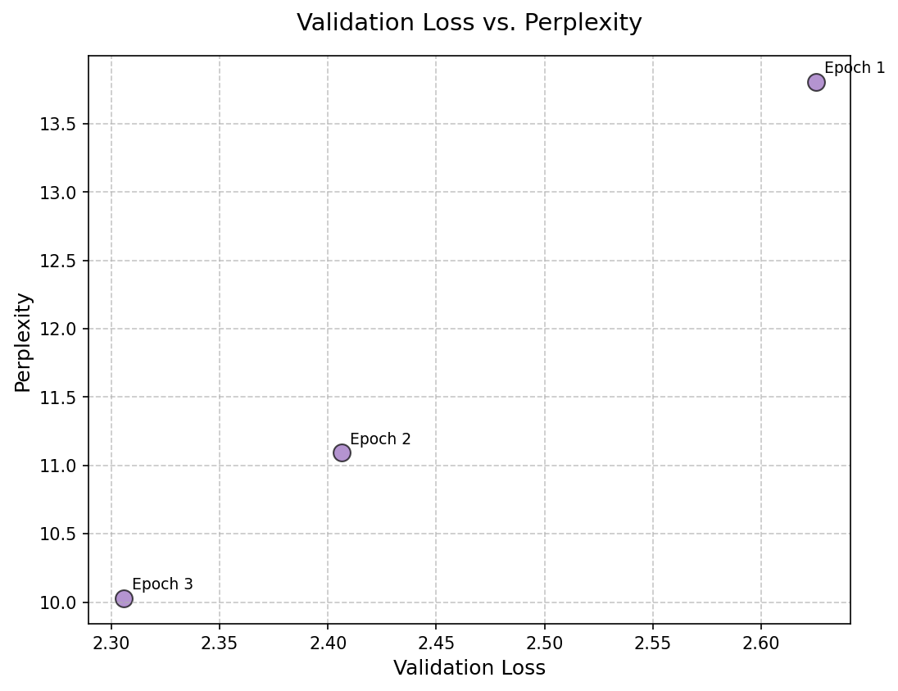

# Conversational AI Chatbot

This project, developed by Bhuvan Indra G, is a conversational AI chatbot built by fine-tuning the **DistilGPT2** model on the `pippa.jsonl` dataset from Hugging Face. Designed as part of a college portfolio to demonstrate machine learning expertise, the chatbot was trained and tested on Kaggle Notebooks using a GPU P100. I created a robust pipeline for data preprocessing, content filtering, model training, and interactive chatting, optimizing the system for Kaggle’s environment. The project is licensed under the MIT License, allowing free use while disclaiming liability (see [LICENSE](LICENSE.txt) and [DISCLAIMER](DISCLAIMER.md)).

## Data Attribution

The `pippa.jsonl` dataset is sourced from [PygmalionAI/PIPPA](https://huggingface.co/datasets/PygmalionAI/PIPPA) on Hugging Face. All usage complies with their terms, and credit is given to PygmalionAI for providing the dataset. Note that the dataset contains content that may not be suitable for all audiences; refer to the dataset card for details.

## Project Status

The chatbot generates conversational responses but may lack full coherence due to the dataset’s variability and DistilGPT2’s lightweight architecture. I welcome contributions to enhance coherence or functionality! Please reach out via [Contact](#contact) to collaborate.

## Models Used

The chatbot is powered by **DistilGPT2**, a distilled version of GPT-2 developed by Hugging Face:
- **Why DistilGPT2?**: I chose DistilGPT2 for its efficiency, requiring less memory and computational power than GPT-2, making it ideal for Kaggle’s GPU P100 (16GB VRAM). It retains strong language generation capabilities while being lightweight.
- **Role**: Used as the base model for fine-tuning on `pippa.jsonl` and for generating responses in the chat script.
- **License**: DistilGPT2 is licensed under Apache 2.0 by Hugging Face.

## Training Process

I designed and implemented the training pipeline for the chatbot, fine-tuning DistilGPT2 on the `pippa.jsonl` dataset. Key aspects of the process include:

- **Data Preprocessing**:
  - Loaded up to 10,000 conversations from `pippa.jsonl`, a JSONL dataset of human-AI dialogues.
  - Implemented a custom content filter to skip conversations with sensitive keywords (e.g., explicit, offensive), ensuring ethical usage.
  - Cleaned messages by removing special characters, normalizing text, and adding a system prompt for professional responses.
  - Tokenized the dataset using DistilGPT2’s tokenizer, with a maximum length of 512 tokens, and cached the tokenized dataset to optimize training.

- **Training Setup**:
  - Fine-tuned DistilGPT2 on Kaggle Notebooks with GPU P100, leveraging the `transformers` and `torch` libraries.
  - Used a batch size of 4 (effective batch size of 16 via gradient accumulation) to manage GPU memory constraints.
  - Trained for 3 epochs with a learning rate of 5e-5, using a cosine scheduler with 1,000 warmup steps for stable optimization.
  - Implemented early stopping (patience of 1 epoch) based on validation loss to prevent overfitting.
  - Saved model checkpoints per epoch and the best model based on validation loss, zipped for easy storage.

- **My Contributions**:
  - Designed the end-to-end pipeline, from data loading to model inference.
  - Developed custom preprocessing to handle JSONL data and filter inappropriate content, ensuring safe outputs.
  - Optimized hyperparameters (e.g., batch size, learning rate) for Kaggle’s GPU, debugging memory issues and tokenization errors.
  - Implemented gradient accumulation and mixed-precision training to maximize efficiency.
  - Created a chat script (`chat_with_model.py`) for interactive testing, allowing users to converse with the trained model.
  - Tested and validated the pipeline on Kaggle, ensuring reproducibility.

- **Output**: The trained model is saved as `conversational_ai_v1`, with the best checkpoint in `conversational_ai_v1_best`. These are excluded from the repository due to size but can be reproduced using the provided scripts.

## Setup

To run the chatbot, follow these steps on Kaggle Notebooks:

1. **Prerequisites**:
   - Kaggle account with phone verification.
   - Internet enabled.

2. **Enable GPU**:
   - Create a Python notebook on Kaggle.
   - Set Accelerator to “GPU P100.”

3. **Download Dataset**:
   ```bash
   wget -O /kaggle/working/pippa.jsonl "https://huggingface.co/datasets/PygmalionAI/PIPPA/resolve/main/pippa.jsonl"
   ```

4. **Train Model**:
   ```bash
   python train_chatbot_kaggle.py
   ```
   - This fine-tunes DistilGPT2 and saves the model to `/kaggle/working/conversational_ai_v1`.

5. **Chat with Model**:
   ```bash
   python chat_with_model.py
   ```
   - Loads the trained model and allows interactive chatting.

## Training Parameters

- **Dataset**: Up to 10,000 conversations from `pippa.jsonl`.
- **Epochs**: 3.
- **Batch Size**: 4 (effective 16 with gradient accumulation).
- **Max Length**: 512 tokens.
- **Learning Rate**: 5e-5 with cosine scheduler and 1,000 warmup steps.
- **Early Stopping**: Patience of 1 epoch based on validation loss.

## Kaggle Notes

- **Environment**: Developed and tested on Kaggle Notebooks with GPU P100 (16GB VRAM, 30 hours/week quota). No additional dependencies were installed, as Kaggle includes `transformers`, `torch`, `datasets`, and `retrying`.
- **Runtime**: ~1–2 hours for training.
- **Troubleshooting**:
  - **Memory**: Reduce `BATCH_SIZE=2` or `MAX_LENGTH=256` in `train_chatbot_kaggle.py` if CUDA errors occur.
  - **GPU**: Verify `torch.cuda.is_available()` in a code cell.
  - **Dataset**: Ensure `pippa.jsonl` is downloaded correctly.

## Disclaimer

This project is for educational purposes only. Please read [DISCLAIMER.md](DISCLAIMER.md) for information on liability, dataset content, and precautions before running the code.

## License

This project is licensed under the MIT License (see [LICENSE](LICENSE.txt)), allowing anyone to use, modify, or distribute the code, subject to the terms therein.

## Attribution

- **DistilGPT2**: [Hugging Face](https://huggingface.co/distilgpt2)
- **Dataset**: [PygmalionAI/PIPPA](https://huggingface.co/datasets/PygmalionAI/PIPPA)

## Contact

To contribute to the project or discuss improvements, contact Bhuvan Indra G via:
- [Email](mailto:gbindra21@gmail.com)
- [Instagram](https://www.instagram.com/bhuvan_indra_0520/)
- [LinkedIn](https://www.linkedin.com/in/bhuvan-indra-995828274?utm_source=share&utm_campaign=share_via&utm_content=profile&utm_medium=android_app)
- Phone No: +91 9491149955

## Visualizations

Explore the training process and dataset insights through these graphs:

- **Conversation Length Distribution**: Pie chart showing the distribution of conversation lengths in the `pippa.jsonl` dataset.
  

- **Loss vs. Epoch**: Line graph tracking training and validation loss over epochs.
  

- **Training and Validation Metrics**: Bar graph comparing training and validation performance metrics.
  

- **Training Metrics Overview**: Radar chart summarizing key training metrics (e.g., loss, perplexity).
  

- **Validation Loss vs. Perplexity**: Scatter plot illustrating the relationship between validation loss and perplexity.
  
